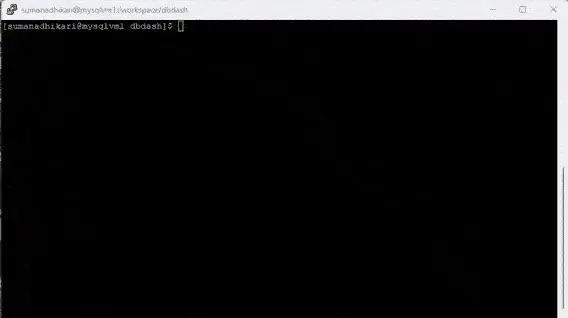
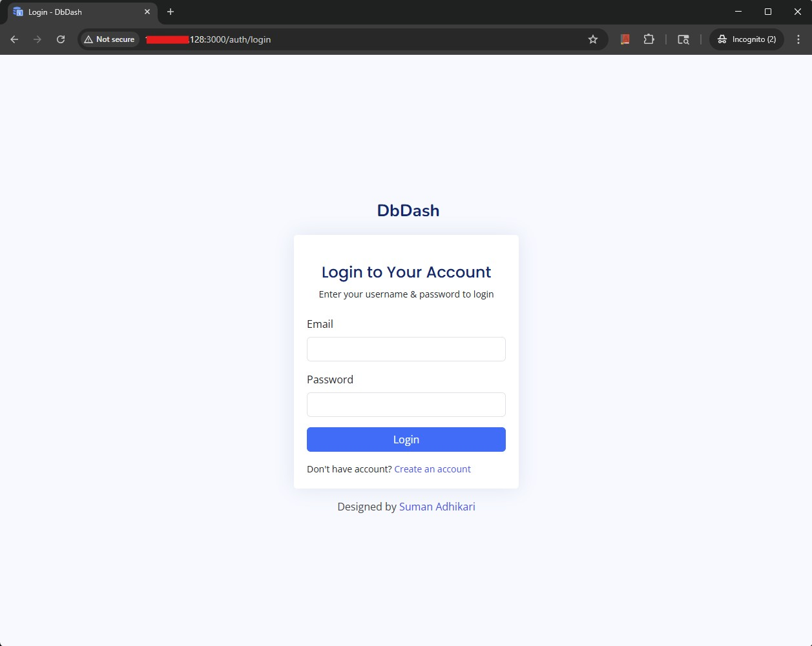
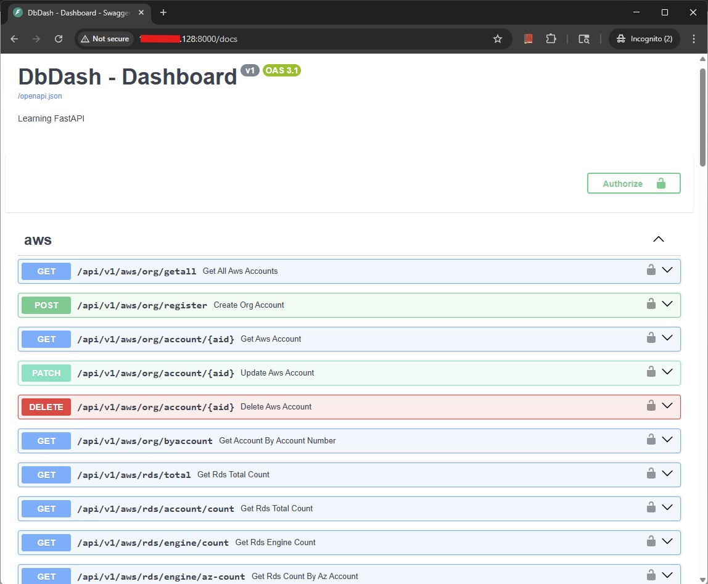

# DBDash – Quick Installation Guide

This document explains how to install, build, and run the complete DbDash stack using Docker and Docker Compose.

The below bash script can be used to build the complete stack using Docker. The full explanation of each component can be found on this.

## Prerequisites:
The following prerequisites must be meet for the successful creation of the DbDash Stack.

1. Docker must be install and should be accessible to the user who is running to script
2. Git must be installed, so that script can fetch the code from github.
3. github.com must be accesible and it should be able clone repo
4. The directory when the script is being run, the user must have ```rwx``` privileges and should be atleast 10G free space.
5. Api env file ```.apienv``` should be there in directory script being run containing enviornment variables for api

Below is a simple example of the directory structure.
```bash
[sumanadhikari@mysqlvm1 dbdash]$ pwd
/workspace/dbdash
[sumanadhikari@mysqlvm1 dbdash]$ ls -altr
total 20
drwxrwxr-x 7 sumanadhikari sumanadhikari   74 Dec 15 09:44 ..
-rw-rw-r-- 1 sumanadhikari sumanadhikari  370 Dec 16 02:50 .apienv
-rwxrwxr-x 1 sumanadhikari sumanadhikari 4173 Dec 16 08:17 dbdash.sh
[sumanadhikari@mysqlvm1 dbdash]$
```




## Quick Installation Script
```bash
#!/bin/bash

function log_message() {
    local message="$1"
    local timestamp=$(date '+%Y-%m-%d %H:%M:%S')
    echo -e "[${timestamp}] ${message}"
}

function check_required_utils() {
    local missing_utils=()

    # List of required utilities
    local utils=(
        "docker"
        "tee"
        "date"
        "which"
        "git"
    )
    log_message "[info] Checking required utilites.."
    for util in "${utils[@]}"; do
        if ! command -v "$util" >/dev/null 2>&1; then
            missing_utils+=("$util")
        else
            log_message "[info] $util found..."
        fi
    done

    if [ ${#missing_utils[@]} -ne 0 ]; then
        log_message "[error] The following required utilities are missing:"
        for util in "${missing_utils[@]}"; do
            log_message "[error]  - $util missing.."
        done
        log_message "[error] Please install the missing utilities before running this script."
        return 1
    fi

    log_message "[info] All required utilities are present."
    return 0
}

function check_dir_permissions() {
    local dir="$1"
    log_message "[info] Testing permissions for: $dir"

    if ! mkdir -p "$dir"; then
        log_message "[error] Cannot create directory $dir"
        exit 1
    fi

    local tmpfile="$dir/tmpfile_$$.txt"
    if ! touch "$tmpfile"; then
        log_message "[error] Cannot write to directory $dir"
        exit 1
    fi

    if ! chmod -R 777 "$dir"; then
        log_message "[error] Cannot change permission for directory $dir"
        rm -f "$tmpfile"
        exit 1
    fi

    rm -f "$tmpfile"
    log_message "[info] Testing permissions for: $dir was successful.."
}

function clone_git_repo(){
   git_repo="$1"
   log_message "[info] Checking repository accessibility... $git_repo"
   if ! git ls-remote "$git_repo" >/dev/null 2>&1; then
      log_message "[error] Repository not reachable or does not exist: $git_repo"
      exit 1
   fi
   log_message "[info] Cloning repository ... $git_repo"
   if ! git clone "$git_repo"; then
      log_message "[error] $git_repo Cloning failed.."
      #exit 1
   fi
   if [ ! -d "dbdash/.git" ]; then
      log_message "[error] Clone verification failed..."
      exit 1
   fi
   log_message "[info] Repository cloned successfully..."
}

function create_stack() {
    log_message "[info] Starting to create DbDash Stack"

    # Create directories
    mkdir -p ./dbdash-repo/init-seed/ \
             ./dbdash-repo/pg_data \
             ./dbdash-api || {
        log_message "Failed to create directories..."
        exit 1
    }

    # Copy database Dockerfile
    log_message "[info] Copying Database Dockerfile..."
    cp ./dbdash/database/Dockerfile ./dbdash-repo || {
        log_message "Failed to copy database Dockerfile..."
        exit 1
    }

    # Copy database seed file
    log_message "[info] Copying Database seed file..."
    cp ./dbdash/database/init_seed.sql ./dbdash-repo/init-seed/ || {
        log_message "Failed to copy database seed script..."
        exit 1
    }

    # Copy main Docker Compose file
    log_message "[info] Copying main stack compose file..."
    cp ./dbdash/dbdashcompose.yml ./ || {
        log_message "Failed to copy main docker compose file..."
        exit 1
    }

    # Copy env file for API
    log_message "[info] Copying env file for API..."
    cp .apienv ./dbdash-api/.env || {
        log_message "Failed to copy API env file..."
        exit 1
    }

    # Build and start the stack
    log_message "[info] Building the stack..."
    docker compose -f dbdashcompose.yml up -d || {
        log_message "Failed to start Docker stack..."
        exit 1
    }

    log_message "[info] DbDash stack created successfully."
}


check_required_utils
log_message "[info] Cleaning up old images and directories"
sudo rm -rf dbdash-repo
sudo rm -rf dbdash-api
rm -rf dbdash
rm -rf dbdashcompose.yml
check_dir_permissions "dbdash-repo"
clone_git_repo "https://github.com/dralmostright/dbdash.git"
docker rmi dbdash-api
docker rmi dbdash-ui
create_stack
docker ps -a
docker logs --tail 50 dbdash-repo
docker logs --tail 50 dbdash-api
docker logs --tail 50 dbdash-ui
if [ "$1" = "seed" ];
then
log_message "[info] Seeding database with demo data.."
log_message "[info] Creating one off docker image/container to seed database.."
docker build -f ./dbdash/collector/Dockerfile.seeder -t seeder-oneoff ./dbdash/collector/ && \
docker run --rm --network dbdash_app-network seeder-oneoff && \
docker rmi seeder-oneoff
fi
```

## Quick Installation log
Your execution log's should look like below for successful installation.
```bash
[sumanadhikari@mysqlvm1 dbdash]$ ./dbdash.sh
[2025-12-16 23:20:41] [info] Checking required utilites..
[2025-12-16 23:20:41] [info] docker found...
[2025-12-16 23:20:41] [info] tee found...
[2025-12-16 23:20:41] [info] date found...
[2025-12-16 23:20:41] [info] which found...
[2025-12-16 23:20:41] [info] git found...
[2025-12-16 23:20:41] [info] All required utilities are present.
[2025-12-16 23:20:41] [info] Cleaning up old images and directories
[2025-12-16 23:20:41] [info] Testing permissions for: dbdash-repo
[2025-12-16 23:20:41] [info] Testing permissions for: dbdash-repo was successful..
[2025-12-16 23:20:41] [info] Checking repository accessibility... https://github.com/dralmostright/dbdash.git
[2025-12-16 23:20:41] [info] Cloning repository ... https://github.com/dralmostright/dbdash.git
Cloning into 'dbdash'...
remote: Enumerating objects: 6354, done.
remote: Counting objects: 100% (158/158), done.
remote: Compressing objects: 100% (54/54), done.
remote: Total 6354 (delta 59), reused 130 (delta 52), pack-reused 6196 (from 2)
Receiving objects: 100% (6354/6354), 53.70 MiB | 3.50 MiB/s, done.
Resolving deltas: 100% (3818/3818), done.
[2025-12-16 23:20:58] [info] Repository cloned successfully...
Error response from daemon: No such image: dbdash-api:latest
Error response from daemon: No such image: dbdash-ui:latest
[2025-12-16 23:20:58] [info] Starting to create DbDash Stack
[2025-12-16 23:20:58] [info] Copying Database Dockerfile...
[2025-12-16 23:20:58] [info] Copying Database seed file...
[2025-12-16 23:20:58] [info] Copying main stack compose file...
[2025-12-16 23:20:58] [info] Copying env file for API...
[2025-12-16 23:20:58] [info] Building the stack...
[+] Running 3/3
 ! ui Warning  pull access denied for dbdash-ui, repository does not exist or may require 'docker login': denied: requested access to the resource is denied                                                                            0.8s
 ! db Warning  pull access denied for dbdash-repo, repository does not exist or may require 'docker login': denied: requested access to the resource is denied                                                                          0.8s
 ! api Warning pull access denied for dbdash-api, repository does not exist or may require 'docker login': denied: requested access to the resource is denied                                                                           0.9s
[+] Building 70.9s (35/35) FINISHED
 => [internal] load local bake definitions                                                                                                                                                                                              0.0s
 => => reading from stdin 1.38kB                                                                                                                                                                                                        0.0s
 => [ui internal] load build definition from Dockerfile                                                                                                                                                                                 0.0s
 => => transferring dockerfile: 492B                                                                                                                                                                                                    0.0s
 => [db internal] load build definition from Dockerfile                                                                                                                                                                                 0.0s
 => => transferring dockerfile: 312B                                                                                                                                                                                                    0.0s
 => [api internal] load build definition from Dockerfile                                                                                                                                                                                0.0s
 => => transferring dockerfile: 348B                                                                                                                                                                                                    0.0s
 => [api internal] load metadata for docker.io/library/python:3.11-slim                                                                                                                                                                 1.0s
 => [db internal] load metadata for docker.io/library/postgres:17                                                                                                                                                                       1.0s
 => [ui internal] load metadata for docker.io/library/nginx:alpine                                                                                                                                                                      1.0s
 => [ui internal] load metadata for docker.io/library/node:20                                                                                                                                                                           1.0s
 => [api internal] load .dockerignore                                                                                                                                                                                                   0.0s
 => => transferring context: 2B                                                                                                                                                                                                         0.0s
 => [api 1/5] FROM docker.io/library/python:3.11-slim@sha256:158caf0e080e2cd74ef2879ed3c4e697792ee65251c8208b7afb56683c32ea6c                                                                                                           7.9s
 => => resolve docker.io/library/python:3.11-slim@sha256:158caf0e080e2cd74ef2879ed3c4e697792ee65251c8208b7afb56683c32ea6c                                                                                                               0.0s
 => => sha256:1733a4cd59540b3470ff7a90963bcdea5b543279dd6bdaf022d7883fdad221e5 29.78MB / 29.78MB                                                                                                                                        2.6s
 => => sha256:72cf4c3b83019e176aba979aba419d35f56576bbcfc4f7249a1ab1d4b536730b 1.29MB / 1.29MB                                                                                                                                          0.2s
 => => sha256:4d55cfecf3663813d03c369bcd532b89f41cf07b65d95887ef686538370a747c 14.36MB / 14.36MB                                                                                                                                        0.7s
 => => sha256:158caf0e080e2cd74ef2879ed3c4e697792ee65251c8208b7afb56683c32ea6c 10.37kB / 10.37kB                                                                                                                                        0.0s
 => => sha256:26fe52250f1b8012f5061c8f7228e6fca4f100aa3f99b41a8aa2608a42c5db43 1.75kB / 1.75kB                                                                                                                                          0.0s
 => => sha256:cb352e69d7b69f39dbc2cc35ecc34d01ca14439abc55911a5f7932f3dd6bd079 5.48kB / 5.48kB                                                                                                                                          0.0s
 => => sha256:3f0cdbca744e7bd0ce0ff6da73b9148829b04309925992954a314ba203f56e99 249B / 249B                                                                                                                                              0.4s
 => => extracting sha256:1733a4cd59540b3470ff7a90963bcdea5b543279dd6bdaf022d7883fdad221e5                                                                                                                                               2.7s
 => => extracting sha256:72cf4c3b83019e176aba979aba419d35f56576bbcfc4f7249a1ab1d4b536730b                                                                                                                                               0.2s
 => => extracting sha256:4d55cfecf3663813d03c369bcd532b89f41cf07b65d95887ef686538370a747c                                                                                                                                               1.7s
 => => extracting sha256:3f0cdbca744e7bd0ce0ff6da73b9148829b04309925992954a314ba203f56e99                                                                                                                                               0.0s
 => [api internal] load build context                                                                                                                                                                                                   0.0s
 => => transferring context: 145.01kB                                                                                                                                                                                                   0.0s
 => [ui internal] load .dockerignore                                                                                                                                                                                                    0.0s
 => => transferring context: 2B                                                                                                                                                                                                         0.0s
 => [ui build 1/6] FROM docker.io/library/node:20@sha256:4b4e58e59c5e042928790c6fccd8ad16da6296bcc2e9924c56fba84a8e5ff662                                                                                                              28.4s
 => => resolve docker.io/library/node:20@sha256:4b4e58e59c5e042928790c6fccd8ad16da6296bcc2e9924c56fba84a8e5ff662                                                                                                                        0.0s
 => => sha256:e515aa06e178a3a8220d860c09e616c8ed461f216604eef30d2bd2c060afd9c4 2.49kB / 2.49kB                                                                                                                                          0.0s
 => => sha256:c8a14e7e1d5835a3952ac83c20b5a859d337b8e6cc1b2eb89f3f4e0125dd516a 6.75kB / 6.75kB                                                                                                                                          0.0s
 => => sha256:4b4e58e59c5e042928790c6fccd8ad16da6296bcc2e9924c56fba84a8e5ff662 6.41kB / 6.41kB                                                                                                                                          0.0s
 => => sha256:c8443a297fa42e27cb10653777dd5a53f82a65fbc8b2d33f82b8722199f941d3 48.48MB / 48.48MB                                                                                                                                        2.3s
 => => sha256:6ae8659f7a8d357662281a0f87eb293725bb75ffa6c7356c38567f557d8a1f11 24.03MB / 24.03MB                                                                                                                                        2.0s
 => => sha256:c237534654fe7a5c118fcee78652af952e57a4a07cc322c0ae3c367839bb0ccc 64.40MB / 64.40MB                                                                                                                                        5.8s
 => => sha256:e8d2a98f6bdfdbb1ba3c937c5e47cfa2cd11e74487543d277ca84f21f12ba393 211.46MB / 211.46MB                                                                                                                                      8.4s
 => => extracting sha256:c8443a297fa42e27cb10653777dd5a53f82a65fbc8b2d33f82b8722199f941d3                                                                                                                                               4.1s
 => => sha256:cf6f22e97faea04f5cd1a36488581b2a212c37a16d0686a72b6eea4914d0d458 3.32kB / 3.32kB                                                                                                                                          3.0s
 => => sha256:098202b7b5875d7f0cbee6a5da982f86c91ae03ec3358165a6e7f2a9a4dc003c 48.41MB / 48.41MB                                                                                                                                        5.6s
 => => sha256:385ae8352fab5a86959ee4e261e38f6c40a9f4f01ea464e10537c220e2fcf605 1.25MB / 1.25MB                                                                                                                                          6.1s
 => => sha256:3e90c76f37ac838b93ab517570c04763bfb894f8e194b9236f68c53550103871 445B / 445B                                                                                                                                              6.0s
 => => extracting sha256:6ae8659f7a8d357662281a0f87eb293725bb75ffa6c7356c38567f557d8a1f11                                                                                                                                               2.5s
 => => extracting sha256:c237534654fe7a5c118fcee78652af952e57a4a07cc322c0ae3c367839bb0ccc                                                                                                                                               4.9s
 => => extracting sha256:e8d2a98f6bdfdbb1ba3c937c5e47cfa2cd11e74487543d277ca84f21f12ba393                                                                                                                                              10.9s
 => => extracting sha256:cf6f22e97faea04f5cd1a36488581b2a212c37a16d0686a72b6eea4914d0d458                                                                                                                                               0.0s
 => => extracting sha256:098202b7b5875d7f0cbee6a5da982f86c91ae03ec3358165a6e7f2a9a4dc003c                                                                                                                                               2.5s
 => => extracting sha256:385ae8352fab5a86959ee4e261e38f6c40a9f4f01ea464e10537c220e2fcf605                                                                                                                                               0.0s
 => => extracting sha256:3e90c76f37ac838b93ab517570c04763bfb894f8e194b9236f68c53550103871                                                                                                                                               0.0s
 => [ui internal] load build context                                                                                                                                                                                                    0.7s
 => => transferring context: 78.82MB                                                                                                                                                                                                    0.6s
 => [ui stage-1 1/3] FROM docker.io/library/nginx:alpine@sha256:052b75ab72f690f33debaa51c7e08d9b969a0447a133eb2b99cc905d9188cb2b                                                                                                       10.4s
 => => resolve docker.io/library/nginx:alpine@sha256:052b75ab72f690f33debaa51c7e08d9b969a0447a133eb2b99cc905d9188cb2b                                                                                                                   0.0s
 => => sha256:052b75ab72f690f33debaa51c7e08d9b969a0447a133eb2b99cc905d9188cb2b 10.33kB / 10.33kB                                                                                                                                        0.0s
 => => sha256:e41316bb39937cebbf2674f26afe9e7bf94b4bbc6a301367891cf85843abfeda 2.50kB / 2.50kB                                                                                                                                          0.0s
 => => sha256:a236f84b9d5d27fe4bf2bab07501cccdc8e16bb38a41f83e245216bbd2b61b5c 10.98kB / 10.98kB                                                                                                                                        0.0s
 => => sha256:014e56e613968f73cce0858124ca5fbc601d7888099969a4eea69f31dcd71a53 3.86MB / 3.86MB                                                                                                                                          6.8s
 => => sha256:dfad290a5c259f8d1ec1938529f8ef602e335a26680497ad56d38e0727e1a10a 1.86MB / 1.86MB                                                                                                                                          6.5s
 => => sha256:5d2cc344426d3d91200b457a771ecfe976de824e165506f5cce5d6b863da1ca9 629B / 629B                                                                                                                                              6.8s
 => => sha256:abdece946203a31d986f184559f417a33c3a8936a80153b2f0ffa208af4a0d48 954B / 954B                                                                                                                                              7.1s
 => => extracting sha256:014e56e613968f73cce0858124ca5fbc601d7888099969a4eea69f31dcd71a53                                                                                                                                               0.4s
 => => sha256:51c30493937c33bd8b568d8aed09d9596f558d08877b05a5e1855516aba05e1f 403B / 403B                                                                                                                                              7.1s
 => => sha256:ad5b65da02cfbd43daa87443b87051f3816a10eb7719938d8cb9a96ee828d471 1.21kB / 1.21kB                                                                                                                                          7.5s
 => => sha256:fc13532503d72b70e7dd276ae52f2743b14326b83c31935c86d7477c66019dea 1.40kB / 1.40kB                                                                                                                                          7.3s
 => => extracting sha256:dfad290a5c259f8d1ec1938529f8ef602e335a26680497ad56d38e0727e1a10a                                                                                                                                               0.2s
 => => sha256:136bc6976c2023e3363e66b88167d08019fece3e756c162c58754e3819bf4063 17.26MB / 17.26MB                                                                                                                                        8.3s
 => => extracting sha256:5d2cc344426d3d91200b457a771ecfe976de824e165506f5cce5d6b863da1ca9                                                                                                                                               0.0s
 => => extracting sha256:abdece946203a31d986f184559f417a33c3a8936a80153b2f0ffa208af4a0d48                                                                                                                                               0.0s
 => => extracting sha256:51c30493937c33bd8b568d8aed09d9596f558d08877b05a5e1855516aba05e1f                                                                                                                                               0.0s
 => => extracting sha256:ad5b65da02cfbd43daa87443b87051f3816a10eb7719938d8cb9a96ee828d471                                                                                                                                               0.0s
 => => extracting sha256:fc13532503d72b70e7dd276ae52f2743b14326b83c31935c86d7477c66019dea                                                                                                                                               0.0s
 => => extracting sha256:136bc6976c2023e3363e66b88167d08019fece3e756c162c58754e3819bf4063                                                                                                                                               1.8s
 => [db internal] load .dockerignore                                                                                                                                                                                                    0.0s
 => => transferring context: 2B                                                                                                                                                                                                         0.0s
 => [db 1/2] FROM docker.io/library/postgres:17@sha256:dca7512acaa113409df7e40d977d801e53c0c8088e45d4311a45b4065ccfdcd3                                                                                                                23.0s
 => => resolve docker.io/library/postgres:17@sha256:dca7512acaa113409df7e40d977d801e53c0c8088e45d4311a45b4065ccfdcd3                                                                                                                    0.0s
 => => sha256:dca7512acaa113409df7e40d977d801e53c0c8088e45d4311a45b4065ccfdcd3 10.23kB / 10.23kB                                                                                                                                        0.0s
 => => sha256:26bb28d37ad007df8a35e13201caa21ba593a0e3994bcd930bb7ac10f7285b35 3.63kB / 3.63kB                                                                                                                                          0.0s
 => => sha256:6e8b59d5003cb4ae3f004703392edf481fa4959635c149520462e095efa31bf2 10.13kB / 10.13kB                                                                                                                                        0.0s
 => => sha256:1733a4cd59540b3470ff7a90963bcdea5b543279dd6bdaf022d7883fdad221e5 29.78MB / 29.78MB                                                                                                                                        2.5s
 => => extracting sha256:1733a4cd59540b3470ff7a90963bcdea5b543279dd6bdaf022d7883fdad221e5                                                                                                                                               2.7s
 => => sha256:c96d81f9e075622dd8281edd1f10d6e927b01a6538e74c658c36957ae5b34d50 1.17kB / 1.17kB                                                                                                                                          7.7s
 => => extracting sha256:c96d81f9e075622dd8281edd1f10d6e927b01a6538e74c658c36957ae5b34d50                                                                                                                                               0.0s
 => => sha256:03ed8dc0f72e37e62afa5b1c665f711dfc24e7fbe11b02274e6fac583aaf5729 6.44MB / 6.44MB                                                                                                                                          8.8s
 => => sha256:17c1d47a62446958337213d2b0979b6d352ec216a45fe1461918e4c85a0234dc 1.26MB / 1.26MB                                                                                                                                          8.6s
 => => sha256:63c4a8e10901736024f80c1dbbcc2ed85c9482c4ca1f70cf4d2078dcd5627d6d 8.20MB / 8.20MB                                                                                                                                          8.9s
 => => sha256:07c0e7a5fd20651148ea9148dfc4ad3c2530ce05c6a0f0a0d56c90127884f4ad 1.31MB / 1.31MB                                                                                                                                          9.0s
 => => extracting sha256:03ed8dc0f72e37e62afa5b1c665f711dfc24e7fbe11b02274e6fac583aaf5729                                                                                                                                               0.6s
 => => sha256:64010c9502d8276815e749c6984543206c50479fd28cb6f4749b86c95359f9ab 116B / 116B                                                                                                                                              9.1s
 => => sha256:6b12fd5de7966b374e106b2732b9686958048ce89d0cfbd41c322900192fdbfc 3.14kB / 3.14kB                                                                                                                                          9.2s
 => => sha256:cd828e6b8ac748ab91bd67aafb0ed0edebca909d79ee94201fae23b5b46bc5a1 114.10MB / 114.10MB                                                                                                                                     15.7s
 => => sha256:e8e96343c58fb443d47c5eebd8715d133efb42cae1e7c88cf8f573f8417311dc 10.33kB / 10.33kB                                                                                                                                        9.3s
 => => sha256:8f27e2ecde524d23e9eac6c5bb9f9e737c1cbafa1a899436ce308953f4038f7c 128B / 128B                                                                                                                                              9.5s
 => => sha256:521d2bc0f7769ad596b7e549fd861c39876f5c5671cb5d00f9faac27e717515f 167B / 167B                                                                                                                                              9.7s
 => => extracting sha256:17c1d47a62446958337213d2b0979b6d352ec216a45fe1461918e4c85a0234dc                                                                                                                                               0.1s
 => => sha256:94820472d21157be6588ae81fae9d5beb906ff2903718364ccf1f1a2e3be603b 5.84kB / 5.84kB                                                                                                                                          9.7s
 => => sha256:ffe9c8605fca08cfcef37b23e9d854c8036299bac225d6d11a684db4d5ca6316 184B / 184B                                                                                                                                              9.9s
 => => extracting sha256:63c4a8e10901736024f80c1dbbcc2ed85c9482c4ca1f70cf4d2078dcd5627d6d                                                                                                                                               0.8s
 => => extracting sha256:07c0e7a5fd20651148ea9148dfc4ad3c2530ce05c6a0f0a0d56c90127884f4ad                                                                                                                                               0.1s
 => => extracting sha256:64010c9502d8276815e749c6984543206c50479fd28cb6f4749b86c95359f9ab                                                                                                                                               0.0s
 => => extracting sha256:6b12fd5de7966b374e106b2732b9686958048ce89d0cfbd41c322900192fdbfc                                                                                                                                               0.0s
 => => extracting sha256:cd828e6b8ac748ab91bd67aafb0ed0edebca909d79ee94201fae23b5b46bc5a1                                                                                                                                               6.7s
 => => extracting sha256:e8e96343c58fb443d47c5eebd8715d133efb42cae1e7c88cf8f573f8417311dc                                                                                                                                               0.0s
 => => extracting sha256:8f27e2ecde524d23e9eac6c5bb9f9e737c1cbafa1a899436ce308953f4038f7c                                                                                                                                               0.0s
 => => extracting sha256:521d2bc0f7769ad596b7e549fd861c39876f5c5671cb5d00f9faac27e717515f                                                                                                                                               0.0s
 => => extracting sha256:94820472d21157be6588ae81fae9d5beb906ff2903718364ccf1f1a2e3be603b                                                                                                                                               0.0s
 => => extracting sha256:ffe9c8605fca08cfcef37b23e9d854c8036299bac225d6d11a684db4d5ca6316                                                                                                                                               0.0s
 => [api 2/5] WORKDIR /app                                                                                                                                                                                                              0.0s
 => [api 3/5] COPY requirements.txt .                                                                                                                                                                                                   0.0s
 => [api 4/5] RUN pip install --no-cache-dir -r requirements.txt                                                                                                                                                                       29.2s
 => [db 2/2] RUN apt-get update && apt-get install -y --no-install-recommends       postgresql-server-dev-17       postgresql-17-cron       postgresql-17-partman       postgresql-contrib     && rm -rf /var/lib/apt/lists/*          36.8s
 => [ui build 2/6] WORKDIR /app                                                                                                                                                                                                         0.0s
 => [ui build 3/6] COPY package*.json ./                                                                                                                                                                                                0.0s
 => [ui build 4/6] RUN npm install                                                                                                                                                                                                     10.3s
 => [api 5/5] COPY . .                                                                                                                                                                                                                  0.1s
 => [api] exporting to image                                                                                                                                                                                                           11.7s
 => => exporting layers                                                                                                                                                                                                                11.7s
 => => writing image sha256:dfb915d59f7fb96559da5cf5405d1cbda5bb6ab33a4ab84ae4f1131f0f10e961                                                                                                                                            0.0s
 => => naming to docker.io/library/dbdash-api                                                                                                                                                                                           0.0s
 => [ui build 5/6] COPY . .                                                                                                                                                                                                             0.8s
 => [ui build 6/6] RUN npm run build                                                                                                                                                                                                   16.4s
 => [api] resolving provenance for metadata file                                                                                                                                                                                        0.0s
 => [ui stage-1 2/3] COPY --from=build /app/dist /usr/share/nginx/html                                                                                                                                                                  0.0s
 => [ui stage-1 3/3] COPY nginx.conf /etc/nginx/conf.d/default.conf                                                                                                                                                                     0.0s
 => [ui] exporting to image                                                                                                                                                                                                             0.3s
 => => exporting layers                                                                                                                                                                                                                 0.3s
 => => writing image sha256:75de3f51dd70f5c2698b4ace484bc9e7ec71ae36595bbba2c9f21d3944ece495                                                                                                                                            0.0s
 => => naming to docker.io/library/dbdash-ui                                                                                                                                                                                            0.0s
 => [ui] resolving provenance for metadata file                                                                                                                                                                                         0.0s
 => [db] exporting to image                                                                                                                                                                                                             9.7s
 => => exporting layers                                                                                                                                                                                                                 9.7s
 => => writing image sha256:297dd43f7e57507981362ed728cfd4e74b05f2fc4fda33b09a4f9c0e5d6b0c0c                                                                                                                                            0.0s
 => => naming to docker.io/library/dbdash-repo                                                                                                                                                                                          0.0s
 => [db] resolving provenance for metadata file                                                                                                                                                                                         0.0s
[+] Running 7/7
 ✔ dbdash-ui                   Built                                                                                                                                                                                                    0.0s
 ✔ dbdash-repo                 Built                                                                                                                                                                                                    0.0s
 ✔ dbdash-api                  Built                                                                                                                                                                                                    0.0s
 ✔ Network dbdash_app-network  Created                                                                                                                                                                                                  0.1s
 ✔ Container dbdash-repo       Started                                                                                                                                                                                                  0.3s
 ✔ Container dbdash-api        Started                                                                                                                                                                                                  0.4s
 ✔ Container dbdash-ui         Started                                                                                                                                                                                                  0.7s
[2025-12-16 23:22:11] [info] DbDash stack created successfully.
The files belonging to this database system will be owned by user "postgres".
This user must also own the server process.

The database cluster will be initialized with locale "en_US.utf8".
The default database encoding has accordingly been set to "UTF8".
The default text search configuration will be set to "english".

Data page checksums are disabled.

fixing permissions on existing directory /var/lib/postgresql/data ... ok
creating subdirectories ... ok
selecting dynamic shared memory implementation ... posix
selecting default "max_connections" ... 100
selecting default "shared_buffers" ... 128MB
selecting default time zone ... Etc/UTC
creating configuration files ... ok
running bootstrap script ... ok
/docker-entrypoint.sh: /docker-entrypoint.d/ is not empty, will attempt to perform configuration
/docker-entrypoint.sh: Looking for shell scripts in /docker-entrypoint.d/
/docker-entrypoint.sh: Launching /docker-entrypoint.d/10-listen-on-ipv6-by-default.sh
10-listen-on-ipv6-by-default.sh: info: Getting the checksum of /etc/nginx/conf.d/default.conf
10-listen-on-ipv6-by-default.sh: info: /etc/nginx/conf.d/default.conf differs from the packaged version
/docker-entrypoint.sh: Sourcing /docker-entrypoint.d/15-local-resolvers.envsh
/docker-entrypoint.sh: Launching /docker-entrypoint.d/20-envsubst-on-templates.sh
/docker-entrypoint.sh: Launching /docker-entrypoint.d/30-tune-worker-processes.sh
/docker-entrypoint.sh: Configuration complete; ready for start up
2025/12/16 17:37:11 [notice] 1#1: using the "epoll" event method
2025/12/16 17:37:11 [notice] 1#1: nginx/1.29.4
2025/12/16 17:37:11 [notice] 1#1: built by gcc 15.2.0 (Alpine 15.2.0)
2025/12/16 17:37:11 [notice] 1#1: OS: Linux 5.4.17-2102.201.3.el8uek.x86_64
2025/12/16 17:37:11 [notice] 1#1: getrlimit(RLIMIT_NOFILE): 1048576:1048576
2025/12/16 17:37:11 [notice] 1#1: start worker processes
2025/12/16 17:37:11 [notice] 1#1: start worker process 29
2025/12/16 17:37:11 [notice] 1#1: start worker process 30
[sumanadhikari@mysqlvm1 dbdash]$ docker ps
CONTAINER ID   IMAGE                   COMMAND                  CREATED         STATUS          PORTS                                              NAMES
59d2c0852a1b   dbdash-ui               "/docker-entrypoint.…"   9 minutes ago   Up 9 minutes    0.0.0.0:3000->80/tcp, [::]:3000->80/tcp            dbdash-ui
834f3be15faf   dbdash-api              "fastapi run src --p…"   9 minutes ago   Up 9 minutes    0.0.0.0:8000->8000/tcp, [::]:8000->8000/tcp        dbdash-api
8f44511726ab   dbdash-repo             "docker-entrypoint.s…"   9 minutes ago   Up 9 minutes    0.0.0.0:5432->5432/tcp, [::]:5432->5432/tcp        dbdash-repo
5df2d87c9560   dpage/pgadmin4:latest   "/entrypoint.sh"         9 days ago      Up 52 minutes   443/tcp, 0.0.0.0:8080->80/tcp, [::]:8080->80/tcp   pgadmin
[sumanadhikari@mysqlvm1 dbdash]$
```

## Consoles
If your installation are successful you should see below URL's working.

### Ui login page


### API Docs


### Database
The last part is you need to register the user using frontend and make the user active 
```sql
update apiusers set is_verified=true and role='admin' where email='<registered email>';
```

With this you should be able to use the DbDash.